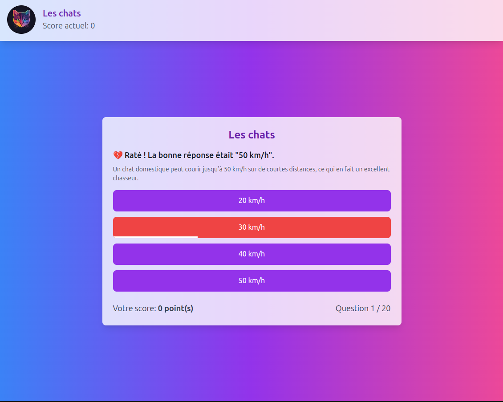

# Family Quiz - A Quiz Application

You can open this project with Visual Studio Code & hit "re-open with Dev Container".  
Or use docker compose: `docker compose up --build -d`

The application will be available through `localhost:3000`.

## Database (psql)

When you're in the IDE using Dev Containers (or inside the Docker container with your CLI):
- `npm run prisma:migrate`
- `npm run prisma:seed` (loads all the quiz fixtures)
- `npm prisma migrate reset` (if you want to reset the db & seed again)
- `npm run prisma:studio` (to inspect the db on `localhost:5555`)

---

TODO:
- Accounts
- Persistence (sessions, scores...)
- Manage quiz data (themes, difficulty...)
- Amazing animations
- ...

---

Note: as a quiz sample, i used data from https://www.openquizzdb.org/